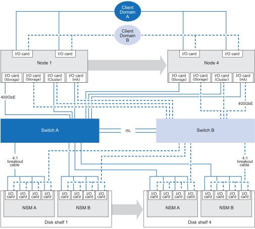

= Configuraciones compatibles para tu sistema de almacenamiento AFX 2K
:allow-uri-read: 
:icons: font
:imagesdir: ../media/

[role="lead"]
Infórmate sobre los componentes de hardware compatibles y las opciones de cableado para el sistema de almacenamiento AFX 2K, incluyendo las estanterías de discos de almacenamiento compatibles, los switches y los tipos de cable necesarios para una correcta configuración del sistema.

[[supported-afx-2k-cabling-configuration]]
== Configuración de cableado AFX 2K compatible

La configuración inicial del sistema de almacenamiento AFX 2K admite un mínimo de cuatro nodos controladores conectados a través de dos switches a las bandejas de discos de almacenamiento.

Los nodos de controlador y las bandejas de discos adicionales amplían la configuración inicial del sistema de almacenamiento AFX 2K. Las configuraciones ampliadas de AFX 2K siguen la misma metodología de cableado basada en switches que el esquema que se muestra a continuación.

[[supported-hardware-components]]
== Componentes de hardware compatibles

Consulta las estanterías de discos de almacenamiento, los switches y los tipos de cable compatibles con el sistema de almacenamiento AFX 2K.

[cols="35%,65%"]
|===
| Componente de hardware | Cables compatibles 

| AFX 2K (bandeja de controladoras)  a| 
* Cables de 400GbE QDD a 400GbE QSFP (conexiones entre el controlador y el switch)
* Cables RJ-45 para conexiones de gestión

| NX224 (Estante para discos)  a| 
* Cables breakout de 400GbE QSFP-DD a 4x100GbE QSFP breakout (conexiones de switch a disk shelf)

| Cisco Nexus 9808 (switch)  a| 
* Cables breakout de 400GbE QSFP-DD a 4x100GbE QSFP breakout (conexiones de switch a disk shelf)
* 2 cables de 400 GbE para conexiones ISL entre el conmutador A y el conmutador B
* Cables RJ-45 para conexiones de gestión

| Cisco Nexus 9332D-GX2B (switch)  a| 
* Cables breakout de 400GbE QSFP-DD a 4x100GbE QSFP breakout (conexiones de switch a disk shelf)
* 2 cables de 400 GbE para conexiones ISL entre el conmutador A y el conmutador B
* Cables RJ-45 para conexiones de gestión

| Cisco Nexus 9364D-GX2A (switch)  a| 
* Cables breakout de 400GbE QSFP-DD a 4x100GbE QSFP breakout (conexiones de switch a disk shelf)
* 2 cables de 400 GbE para conexiones ISL entre el conmutador A y el conmutador B
* Cables RJ-45 para conexiones de gestión

|===
.¿Que sigue?
Tras revisar la configuración del sistema y los componentes de hardware compatibles, link:install-network-reqs.html["Revisa los requisitos de red para tu sistema de almacenamiento AFX 2K"].
