= Conecta el hardware de tu sistema de almacenamiento AFX 2K
:allow-uri-read: 
:icons: font
:imagesdir: ../media/

[role="lead"]
Después de instalar el hardware de montaje en rack de tu sistema de almacenamiento AFX 2K, instala los cables de red para los controladores y conecta los cables entre los controladores y las bandejas de almacenamiento.

.Antes de empezar
Comuníquese con su administrador de red para obtener información sobre cómo conectar el sistema de almacenamiento a sus conmutadores de red.

.Acerca de esta tarea
* Estos procedimientos muestran configuraciones comunes.  El cableado específico depende de los componentes pedidos para su sistema de almacenamiento.  Para obtener detalles completos de configuración y prioridades de ranuras, consultelink:https://hwu.netapp.com["NetApp Hardware Universe"^] .
* Las ranuras de E/S de un controlador AFX 2K están numeradas del 1 al 11.
+
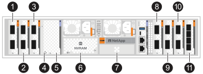

+
[cols="10%,23%,10%,24%,10%,23%"]
|===
| Número de ranura | Ranura de E/S | Número de ranura | Ranura de E/S | Número de ranura | Ranura de E/S 

 a| 
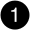
| HA  a| 

| NVRAM12  a| 
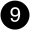
| Red 

 a| 

| Grupo  a| 

| NVRAM12-EX  a| 
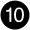
| Almacenamiento 

 a| 
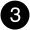
| Red  a| 

| Almacenamiento  a| 
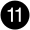
| (*Opcional*) Cuatro puertos SFP28 de 25GbE para conectividad de gestión adicional 
|===
* Los gráficos de cableado muestran íconos de flechas que indican la orientación correcta (arriba o abajo) de la pestaña del conector del cable al insertar un conector en un puerto.
+
Al insertar el conector, debe sentir que encaja en su lugar; si no siente que encaja, retírelo, déle la vuelta e inténtelo nuevamente.

+
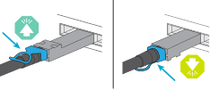

+
[NOTE]
====
Los componentes del conector son delicados y se debe tener cuidado al encajarlos en su lugar.

====
* Al realizar el cableado a una conexión de fibra óptica, inserte el transceptor óptico en el puerto del controlador antes de realizar el cableado al puerto del conmutador.
* El sistema de almacenamiento AFX 2K utiliza cables de 400GbE. Las conexiones de 400GbE se hacen entre los controladores y los switches. Las conexiones entre los estantes de almacenamiento y los switches usan cables breakout de 4x100GbE, con las conexiones de 100GbE hechas a los puertos del estante de unidades.
+
Las conexiones de almacenamiento en estantería pueden realizarse en cualquier puerto de breakout de 100GbE del switch. Las conexiones de alta disponibilidad/clúster pueden realizarse en cualquier puerto de 400GbE del switch. Todos los puertos de controlador "a" se conectan al switch A, y todos los puertos de controlador "b" se conectan al switch B.

* Los adaptadores de red NVIDIA C6X-DX y CX7 (100GbE) no admiten el uso combinado de conexiones de cobre y conexiones ópticas (cables). Debes utilizar exclusivamente conexiones de cobre o ópticas y evitar combinar diferentes tipos de conexión. La combinación de tipos puede provocar la saturación del enlace tras un uso prolongado.
+
Asegúrate de que dispones de los cables adecuados para tu tipo de conexión antes de realizar el cableado de los conmutadores.

+

NOTE: Para obtener más información sobre cómo combinar distintos tipos de conexión, consulta el artículo de base de conocimientos de NetApp link:https://kb.netapp.com/on-prem/ontap/OHW/OHW-Issues/CHW-3504["Se han detectado errores de enlace CRC en la NIC CX6-DX con cables breakout mixtos de cobre y fibra en los puertos"^].

[[step-1-connect-the-controllers-to-the-management-network]]
== Paso 1: Conecte los controladores a la red de administración

Conecta el puerto de gestión (llave inglesa) de cada controlador a cualquiera de los switches de gestión o conéctalos directamente a tu red de gestión.

Utilice los cables RJ-45 1000BASE-T para conectar los puertos de administración (llave) de cada controlador a los conmutadores de red de administración.

*Cables RJ-45 1000BASE-T*

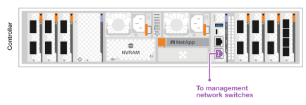

IMPORTANT: No enchufe todavía los cables de alimentación.

.Pasos
. Conéctate a la red de gestión.

[[step-2-connect-the-controllers-to-the-host-network]]
== Paso 2: Conecte los controladores a la red del host

Conecte los puertos del módulo Ethernet a su red host.

Este procedimiento puede variar según la configuración del módulo de E/S.  Los siguientes son algunos ejemplos típicos de cableado de red de host.  Verlink:https://hwu.netapp.com["NetApp Hardware Universe"^] para la configuración específica de su sistema.

.Pasos
. Conecte los siguientes puertos a su conmutador de red de datos Ethernet A.
+
** Controladora
+
*** e3a
*** e9a
+
*cables 400GbE*

+
image::../media/oie_cable100_gbe_qsfp28.png[cable Ethernet de 400 Gb]

+
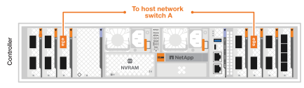

. Conecte los siguientes puertos a su conmutador de red de datos Ethernet B.
+
** Controladora
+
*** e3b
*** e9b
+
*cables 400GbE*

+
image::../media/oie_cable100_gbe_qsfp28.png[cable Ethernet de 400 Gb]

+
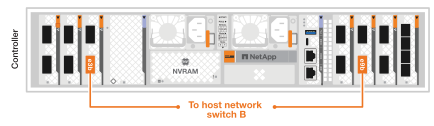

[[step-3-cable-the-cluster-and-ha-connections]]
== Paso 3: Conecta los cables del clúster y de la interconexión de alta disponibilidad

Utiliza el cable de interconexión de clúster y de alta disponibilidad para conectar los puertos e1a y e2a al switch A y los puertos e1b y e2b al switch B. Los puertos e1a/e1b se usan para las conexiones de alta disponibilidad y los puertos e2a/e2a se usan para las conexiones de clúster.

.Pasos
. Conecta los siguientes puertos del controlador a cualquier puerto que no sea ISL en el switch de red A del clúster.
+
** Controladora
+
*** e1a (HA)
*** e2a (clúster)
+
*cables 400GbE*

+

+
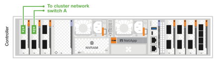

. Conecta los siguientes puertos del controlador a cualquier puerto que no sea ISL en el switch de red B del clúster.
+
** Controladora
+
*** e1b (HA)
*** e2b (clúster)
+
*cables 400GbE*

+

+
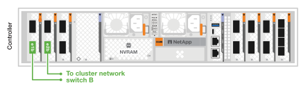

[[step-4-cable-the-controller-to-switch-storage-connections]]
== Paso 4: Conecta el almacenamiento del controlador al switch

Conecta los puertos de almacenamiento del controlador a los switches. Asegúrate de que tienes los cables y conectores correctos para tus switches. Consulta https://hwu.netapp.com["Hardware Universe"^] para más información.

NOTE: Los puertos e10b y e8a de los controladores no se utilizan para conexiones de almacenamiento en la configuración del sistema de almacenamiento AFX 2K.

.Pasos
. Conecta los siguientes puertos de almacenamiento a cualquier puerto que no sea ISL del switch A.
+
** Controladora
+
*** e10a
+
*cables 400GbE*

+
image::../media/oie_cable100_gbe_qsfp28.png[Cable de 100 GB]

+
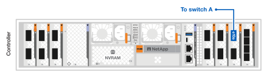

. Conecta los siguientes puertos de almacenamiento a cualquier puerto que no sea ISL del switch B.
+
** Controladora
+
*** e8b
+
*cables 400GbE*

+
image::../media/oie_cable100_gbe_qsfp28.png[Cable de 100 GB]

+
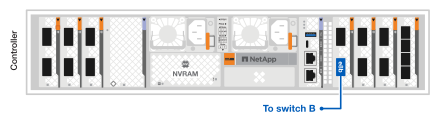

[[step-5-cable-the-shelf-to-switch-connections]]
== Paso 5: Conecte las conexiones del estante al conmutador

Conecta las estanterías de almacenamiento NX224 a los puertos breakout de 100GbE de los switches.

Para conocer la cantidad máxima de estantes admitidos para su sistema de almacenamiento y todas sus opciones de cableado, consultelink:https://hwu.netapp.com["NetApp Hardware Universe"^] .

.Pasos
. Conecta los siguientes puertos del shelf a cualquier puerto de breakout en el switch A y el switch B para el módulo A.
+
** Módulo A para cambiar las conexiones A
+
*** e1a
*** e2a
*** e3a
*** e4a

** Conexiones del módulo A al conmutador B
+
*** e1b
*** e2b
*** e3b
*** e4b
+
*Cables de 100 GbE*

+
image::../media/oie_cable100_gbe_qsfp28.png[Cable de 100 GB]

+
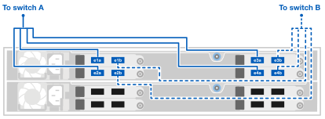

. Conecta los siguientes puertos del shelf a cualquier puerto de breakout en el switch A y el switch B para el módulo B.
+
** Módulo B para cambiar las conexiones A
+
*** e1a
*** e2a
*** e3a
*** e4a

** Módulo B para cambiar las conexiones B
+
*** e1b
*** e2b
*** e3b
*** e4b
+
*Cables de 100 GbE*

+
image::../media/oie_cable100_gbe_qsfp28.png[Cable de 100 GB]

+
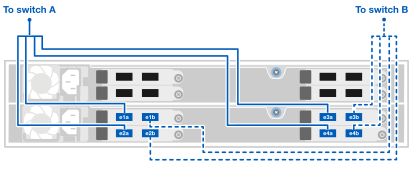

.¿Que sigue?
Después de cablear el hardware,link:power-on-configure-switch.html["Encender y configurar los conmutadores"] .
