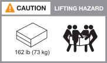
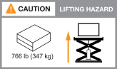
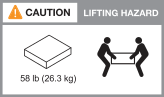

= Requisitos de instalación para los sistemas de almacenamiento AFX 2K
:allow-uri-read: 
:icons: font
:imagesdir: ../media/

[role="lead"]
Revisa el equipo necesario y las precauciones de elevación para tu controlador de almacenamiento AFX 2K y tus estanterías de almacenamiento.

[[equipment-needed-for-install]]
== Equipo necesario para la instalación

Para instalar tu sistema de almacenamiento AFX 2K, necesitas el siguiente equipo y herramientas.

* Acceso a un navegador web para configurar su sistema de almacenamiento
* Correa de descarga electrostática (ESD)
* Flash
* Portátil o consola con conexión USB/serie
* Clip o bolígrafo de punta estrecha para fijar la identificación de los estantes de almacenamiento
* Destornillador Phillips n.° 2

[[lifting-precautions]]
== Precauciones al levantar objetos

El controlador de almacenamiento AFX y los estantes de almacenamiento son pesados.  Tenga cuidado al levantar y mover estos artículos.

[[storage-controller-weights]]
=== Pesos del controlador de almacenamiento

Toma las precauciones necesarias al mover o levantar tu controlador de almacenamiento AFX 2K.

Un controlador de almacenamiento AFX 2K puede pesar hasta 64,0 lb (29,03 kg). Para levantar el controlador de almacenamiento, usa dos personas o una grúa hidráulica.

.Precaución al levantar el controlador AFX 2K.

[[storage-shelf-weights]]
=== Pesas para estantes de almacenamiento

Tome las precauciones necesarias al mover o levantar su estante.

.Estante NX224
Un estante NX224 puede pesar hasta 60,1 lb (27,3 kg). Para levantar el estante, usa dos personas o un elevador hidráulico. Mantén todos los componentes en el estante (tanto en la parte delantera como en la trasera) para evitar que el peso del estante quede desequilibrado.

.Precaución al levantar la bandeja NX224.

[[switch-weights]]
=== Pesos de los switches

Toma las precauciones necesarias al mover o levantar el switch.

.Cisco Nexus 9808
Un Cisco 9808 sin carga puede pesar hasta link:https://www.cisco.com/c/en/us/products/collateral/switches/nexus-9000-series-switches/nexus9800-series-switches-ds.html#Productspecifications["162 lb (73 kg) y un switch Cisco 9808 a plena carga puede llegar a pesar hasta 766 lb (347 kg)"^]. Para levantar el switch, usa una grúa hidráulica.

.Precaución al levantar el Cisco Nexus 9808 sin carga.

.Precaución al levantar el Cisco Nexus 9808 a plena carga.

.Cisco Nexus9332D-GX2B
Un Cisco 9332D-GX2B puede pesar hasta link:https://www.cisco.com/c/en/us/td/docs/dcn/hw/aci/nexus9000/9332d-gx2b/cisco-nexus-9332d-gx2b-aci-mode-switch-hardware-installation-guide/m_n93xxx_system_specs.html["12,7 kg (28,1 lb)"^].

.Cisco Nexus 9364D-GX2A
Un switch Cisco Nexus 9364D-GX2A puede pesar hasta link:https://www.cisco.com/c/en/us/td/docs/dcn/hw/nx-os/nexus9000/9364d-gx2a/cisco-nexus-9364d-gx2a-nx-os-mode-switch-hardware-installation-guide/m_n93xxx_system_specs.html["58 lb (26,3 kg)"^]. Para levantar el switch, usa dos personas o un elevador hidráulico.

.Precaución al levantar el Cisco Nexus 9364D-GX2A.

.Información relacionada
* https://library.netapp.com/ecm/ecm_download_file/ECMP12475945["Información de seguridad y avisos reglamentarios"^]

.¿Que sigue?
Después de que hayas revisado los requisitos de hardware, link:prepare-hardware.html["Prepárate para instalar tu sistema de almacenamiento AFX 2K"].
