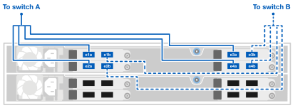

= Conecte el hardware para su sistema de almacenamiento AFX 1K
:allow-uri-read: 
:icons: font
:imagesdir: ../media/

[role="lead"]
Después de instalar el hardware del rack para su sistema de almacenamiento AFX 1K, instale los cables de red para los controladores y conecte los cables entre los controladores y los estantes de almacenamiento.

.Antes de empezar
Comuníquese con su administrador de red para obtener información sobre cómo conectar el sistema de almacenamiento a sus conmutadores de red.

.Acerca de esta tarea
* Estos procedimientos muestran configuraciones comunes.  El cableado específico depende de los componentes pedidos para su sistema de almacenamiento.  Para obtener detalles completos de configuración y prioridades de ranuras, consultelink:https://hwu.netapp.com["NetApp Hardware Universe"^] .
* Las ranuras de E/S de un controlador AFX están numeradas del 1 al 11.
+
image::../media/drw_a1K_back_slots_labeled_ieops-2162.svg[Numeración de ranuras en un controlador AFX]

* Los gráficos de cableado muestran íconos de flechas que indican la orientación correcta (arriba o abajo) de la pestaña del conector del cable al insertar un conector en un puerto.
+
Al insertar el conector, debe sentir que encaja en su lugar; si no siente que encaja, retírelo, déle la vuelta e inténtelo nuevamente.

+
image:../media/drw_cable_pull_tab_direction_ieops-1699.svg["Dirección de la lengüeta de tiro del cable"]

+
[NOTE]
====
Los componentes del conector son delicados y se debe tener cuidado al encajarlos en su lugar.

====
* Al realizar el cableado a una conexión de fibra óptica, inserte el transceptor óptico en el puerto del controlador antes de realizar el cableado al puerto del conmutador.
* El sistema de almacenamiento AFX 1K utiliza cuatro cables de conexión de 100 GbE en el clúster y la red de almacenamiento.  Las conexiones de 400 GbE se realizan a los puertos del conmutador y las conexiones de 100 GbE se realizan a los puertos del controlador y del estante de la unidad.  Se pueden realizar conexiones de almacenamiento y HA/clúster a cualquier puerto que no sea ISL en el conmutador.
+
Para una conexión determinada con un cable de conexión de 4 x 100 GbE al puerto del conmutador específico, se conectan los 4 puertos que van al conmutador a través de este único cable de conexión.

+
** 1 puerto HA (ranura 1)
** 1 x puerto de clúster (ranura 7)
** 2 puertos de almacenamiento (ranuras 10, 11)
+
Todos los puertos 'a' se conectan al conmutador A y todos los puertos 'b' se conectan al conmutador B.

NOTE: Las configuraciones de conmutadores Cisco Nexus 9332D-GX2B y 9364D-GX2A para el sistema de almacenamiento AFX 1K requieren conexiones de cable de conexión 4x100GbE.

== Paso 1: Conecte los controladores a la red de administración

Conecte el puerto de administración de cada conmutador a cualquiera de los conmutadores de administración (si se solicitaron) o conéctelos directamente a su red de administración.

El puerto de administración es el puerto superior derecho ubicado en el lado de la fuente de alimentación del conmutador.  El cable CAT6 de cada conmutador debe pasarse a través del panel de paso después de instalar los conmutadores para conectarlos a los conmutadores de administración o a la red de administración.

Utilice los cables RJ-45 1000BASE-T para conectar los puertos de administración (llave) de cada controlador a los conmutadores de red de administración.

image::../media/oie_cable_rj45.png[Cables RJ-45]

*Cables RJ-45 1000BASE-T*

image::../media/drw_afx_management_connection_ieops-2349.svg[Conéctese a su red de gestión]

IMPORTANT: No enchufe todavía los cables de alimentación.

. Conectarse a la red del host.

== Paso 2: Conecte los controladores a la red del host

Conecte los puertos del módulo Ethernet a su red host.

Este procedimiento puede variar según la configuración del módulo de E/S.  Los siguientes son algunos ejemplos típicos de cableado de red de host.  Verlink:https://hwu.netapp.com["NetApp Hardware Universe"^] para la configuración específica de su sistema.

.Pasos
. Conecte los siguientes puertos a su conmutador de red de datos Ethernet A.
+
** Controlador A (Ejemplo)
+
*** e2a
*** e3a

** Controlador B (Ejemplo)
+
*** e2a
*** e3a
+
*Cables de 100 GbE*

+
image::../media/oie_cable100_gbe_qsfp28.png[Cable Ethernet de 100 Gb]

+
image::../media/drw_afx_network_cabling_a_ieops-2350.svg[Cable a red Ethernet]

. Conecte los siguientes puertos a su conmutador de red de datos Ethernet B.
+
** Controlador A (Ejemplo)
+
*** e2b
*** e3b

** Controlador B (Ejemplo)
+
*** e2b
*** e3b
+
*Cables de 100 GbE*

+
image::../media/oie_cable100_gbe_qsfp28.png[Cable Ethernet de 100 Gb]

+
image::../media/drw_afx_network_cabling_b_ieops-2351.svg[Cable a red Ethernet]

== Paso 3: Conecte el clúster y las conexiones HA

Utilice el cable de interconexión de clúster y HA para conectar los puertos e1a y e7a al conmutador A y e1b y e7b al conmutador B. Los puertos e1a/e1b se utilizan para las conexiones de HA y los puertos e7a/e7b se utilizan para las conexiones de clúster.

.Pasos
. Conecte los siguientes puertos de controlador a cualquier puerto que no sea ISL en el conmutador de red del clúster A.
+
** Controlador A
+
*** e1a
*** e7a

** Controlador B
+
*** e1a
*** e7a
+
*Cables de 100 GbE*

+
image::../media/oie_cable_25Gb_Ethernet_SFP28_ieops-1069.png[Cable de alta disponibilidad del clúster]

+
image::../media/drw_afx_switched_cluster_cabling_a_ieops-2352.svg[Conexiones de clúster de cables a la red de clúster]

. Conecte los siguientes puertos de controlador a cualquier puerto que no sea ISL en el conmutador de red del clúster B.
+
** Controlador A
+
*** e1b
*** e7b

** Controlador B
+
*** e1b
*** e7b
+
*Cables de 100 GbE*

+
image::../media/oie_cable_25Gb_Ethernet_SFP28_ieops-1069.png[Cable de alta disponibilidad del clúster]

+
image::../media/drw_afx_switched_cluster_cabling_b_ieops-2353.svg[Conexiones de clúster de cables a la red de clúster]

== Paso 4: Conecte las conexiones de almacenamiento del controlador al conmutador

Conecte los puertos de almacenamiento del controlador a los conmutadores.  Asegúrese de tener los cables y conectores correctos para sus conmutadores. Ver https://hwu.netapp.com["Hardware Universe"^] Para más información.

. Conecte los siguientes puertos de almacenamiento a cualquier puerto que no sea ISL en el conmutador A.
+
** Controlador A
+
*** e10a
*** e11a

** Controlador B
+
*** e10a
*** e11a
+
*Cables de 100 GbE*

+
image::../media/oie_cable100_gbe_qsfp28.png[Cable de 100 GB]

+
image::../media/drw_afx_controller_storage_cable_a_ieops-2354.svg[Almacenamiento del controlador de cable al conmutador A]

. Conecte los siguientes puertos de almacenamiento a cualquier puerto que no sea ISL en el conmutador B.
+
** Controlador A
+
*** e10b
*** e11b

** Controlador B
+
*** e10b
*** e11b
+
*Cables de 100 GbE*

+
image::../media/oie_cable100_gbe_qsfp28.png[Cable de 100 GB]

+
image::../media/drw_afx_controller_storage_cable_b_ieops-2355.svg[Almacenamiento del controlador de cable al conmutador B]

== Paso 5: Conecte las conexiones del estante al conmutador

Conecte los estantes de almacenamiento NX224 a los conmutadores.

Para conocer la cantidad máxima de estantes admitidos para su sistema de almacenamiento y todas sus opciones de cableado, consultelink:https://hwu.netapp.com["NetApp Hardware Universe"^] .

. Conecte los siguientes puertos de estante a cualquier puerto que no sea ISL en el conmutador A y el conmutador B para el módulo A.
+
** Módulo A para cambiar las conexiones A
+
*** e1a
*** e2a
*** e3a
*** e4a

** Conexiones del módulo A al conmutador B
+
*** e1b
*** e2b
*** e3b
*** e4b
+
*Cables de 100 GbE*

+
image::../media/oie_cable100_gbe_qsfp28.png[Cable de 100 GB]

+

. Conecte los siguientes puertos de estante a cualquier puerto que no sea ISL en el conmutador A y el conmutador B para el módulo B.
+
** Módulo B para cambiar las conexiones A
+
*** e1a
*** e2a
*** e3a
*** e4a

** Módulo B para cambiar las conexiones B
+
*** e1b
*** e2b
*** e3b
*** e4b
+
*Cables de 100 GbE*

+
image::../media/oie_cable100_gbe_qsfp28.png[Cable de 100 GB]

+
image::../media/drw_afx_shelf_cabling_b_ieops-2357.svg[Estante para cables para interruptor A e interruptor B]

.¿Que sigue?
Después de cablear el hardware,link:power-on-configure-switch.html["Encender y configurar los conmutadores"] .
