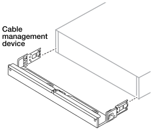

= Instale su sistema de almacenamiento AFX 1K
:allow-uri-read: 
:icons: font
:imagesdir: ../media/

[role="lead"]
Después de instalar los conmutadores, debe instalar el hardware para su sistema de almacenamiento AFX 1K.  Primero, instale los kits de rieles.  Luego instale y asegure su sistema de almacenamiento en un gabinete o rack de telecomunicaciones.

.Antes de empezar
* Asegúrese de tener las instrucciones incluidas con el kit de riel.
* Comprenda las preocupaciones de seguridad relacionadas con el peso del sistema de almacenamiento y el estante de almacenamiento.
* Comprenda que el flujo de aire a través del sistema de almacenamiento ingresa desde el frente donde están instalados el bisel o las tapas de los extremos y sale por la parte trasera donde se encuentran los puertos.

.Pasos
. Instale los kits de rieles para su sistema de almacenamiento y estantes de almacenamiento, según sea necesario, utilizando las instrucciones incluidas con los kits.
. Instale y asegure su controlador en el gabinete o rack de telecomunicaciones:
+
.. Coloque el sistema de almacenamiento sobre los rieles en el medio del gabinete o rack de telecomunicaciones y luego sostenga el sistema de almacenamiento desde abajo y deslícelo hasta su lugar.
.. Asegure el sistema de almacenamiento al gabinete o al rack de telecomunicaciones utilizando los tornillos de montaje incluidos.

. Coloque el bisel en la parte frontal del controlador.
. Si su sistema de almacenamiento AFX 1K viene con un dispositivo de administración de cables, conéctelo a la parte posterior del sistema de almacenamiento.
+

. Instalar y asegurar el estante de almacenamiento:
+
.. Coloque la parte posterior del estante de almacenamiento sobre los rieles y luego sostenga el estante desde abajo y deslícelo dentro del gabinete o rack de telecomunicaciones.
+
En general, los estantes de almacenamiento y los controladores deben instalarse cerca de los interruptores.  Si está instalando varios estantes de almacenamiento, coloque el primer estante de almacenamiento directamente encima de los controladores.  Coloque el segundo estante de almacenamiento directamente debajo de los controladores.  Repita este patrón para cualquier estante de almacenamiento adicional.

.. Asegure el estante de almacenamiento al gabinete o al rack de telecomunicaciones usando los tornillos de montaje incluidos.

.¿Que sigue?
Después de haber instalado el hardware para su sistema AFX, revise lalink:afx-cable-overview.html["Configuraciones de cableado compatibles con su sistema de almacenamiento AFX 1K"] .
