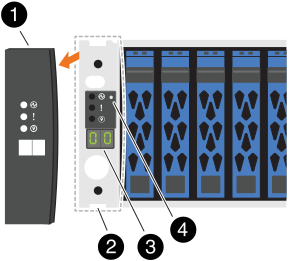
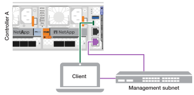
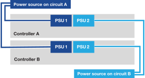

= Encienda su sistema de almacenamiento AFX 1K
:allow-uri-read: 
:icons: font
:imagesdir: ../media/

[role="lead"]
Después de instalar el hardware del rack para su sistema de almacenamiento AFX 1K e instalar los cables para los nodos del controlador y los estantes de almacenamiento, debe encender los estantes de almacenamiento y los nodos del controlador.

[[step-1-power-on-the-shelf-and-assign-shelf-id]]
== Paso 1: Encienda el estante y asígnele un ID

Cada estante tiene un ID de estante único, lo que garantiza su distinción en la configuración de su sistema de almacenamiento.

.Acerca de esta tarea
* Un ID de estante válido es del 01 al 99.
* Debe apagar y encender nuevamente un estante (desenchufar ambos cables de alimentación, esperar un mínimo de 10 segundos y luego volver a enchufarlos) para que la identificación del estante tenga efecto.

.Pasos
. Encienda el estante conectando primero los cables de alimentación al estante, asegurándolos en su lugar con el retenedor del cable de alimentación y luego conectando los cables de alimentación a fuentes de energía en diferentes circuitos.
+
El estante se enciende y arranca automáticamente cuando se enchufa.

. Retire la tapa del extremo izquierdo para acceder al botón de identificación del estante detrás de la placa frontal.
+

+
[cols="20%,80%"]
|===

 a| 
image::../media/icon_round_1.png[Llamada número 1]
 a| 
Tapa del extremo del estante

 a| 
image::../media/icon_round_2.png[[Número de llamada 2]
 a| 
Placa frontal del estante

 a| 
image::../media/icon_round_3.png[[Número de llamada 3]
 a| 
Número de identificación del estante

 a| 
image::../media/icon_round_4.png[[Número de llamada 4]
 a| 
Botón de identificación de estante

|===
. Cambiar el primer número del ID del estante:
+
.. Inserte el extremo recto de un clip o un bolígrafo de punta estrecha en el orificio pequeño para presionar suavemente el botón de identificación del estante.
.. Presione suavemente y mantenga presionado el botón de identificación del estante hasta que el primer número en la pantalla digital parpadee y luego suelte el botón.
+
El número parpadea durante 15 segundos, activando el modo de programación de identificación del estante.

+

NOTE: Si el ID tarda más de 15 segundos en parpadear, presione y mantenga presionado nuevamente el botón de ID del estante, asegurándose de presionarlo hasta el fondo.

.. Presione y suelte el botón de identificación del estante para avanzar el número hasta llegar al número deseado del 0 al 9.
+
La duración de cada pulsación y liberación puede ser tan corta como un segundo.

+
El primer número continúa parpadeando.

. Cambiar el segundo número del ID del estante:
+
.. Mantenga presionado el botón hasta que el segundo número en la pantalla digital parpadee.
+
El número puede tardar hasta tres segundos en parpadear.

+
El primer número en la pantalla digital deja de parpadear.

.. Presione y suelte el botón de identificación del estante para avanzar el número hasta llegar al número deseado del 0 al 9.
+
El segundo número continúa parpadeando.

. Bloquee el número deseado y salga del modo de programación presionando y manteniendo presionado el botón de identificación del estante hasta que el segundo número deje de parpadear.
+
El número puede tardar hasta tres segundos en dejar de parpadear.

+
Ambos números en la pantalla digital comienzan a parpadear y el LED ámbar se ilumina después de aproximadamente cinco segundos, alertándole que la identificación del estante pendiente aún no ha tenido efecto.

. Apague y encienda el estante durante al menos 10 segundos para que la identificación del estante tenga efecto.
+
.. Desconecte el cable de alimentación de ambas fuentes de alimentación en el estante.
.. Espere 10 segundos.
.. Vuelva a enchufar los cables de alimentación a las fuentes de alimentación del estante para completar el ciclo de energía.
+
La fuente de alimentación se enciende tan pronto como se conecta el cable de alimentación.  Su LED bicolor debe iluminarse en verde.

. Vuelva a colocar la tapa del extremo izquierdo.

[[step-2-power-on-the-controller-nodes]]
== Paso 2: Encienda los nodos del controlador

Después de haber encendido los estantes de almacenamiento y haberles asignado identificaciones únicas, encienda los nodos del controlador de almacenamiento.

.Pasos
. Conecte su computadora portátil al puerto de consola serie.  Esto le permite monitorear la secuencia de arranque cuando se encienden los controladores.
+
.. Configure el puerto de consola serie de la computadora portátil a 115,200 baudios con N-8-1.
+
Consulte la ayuda en línea de su computadora portátil para obtener instrucciones sobre cómo configurar el puerto de consola serie.

.. Conecte el cable de la consola a la computadora portátil y conecte el puerto de consola serial en el controlador usando el cable de consola que viene con su sistema de almacenamiento.
.. Conecte la computadora portátil al conmutador en la subred de administración.
+

. Asigne una dirección TCP/IP a la computadora portátil, utilizando una que esté en la subred de administración.
. Conecte los cables de alimentación a las fuentes de alimentación del controlador y luego conéctelos a fuentes de alimentación en diferentes circuitos.
+

+
** El sistema comienza a arrancar.  El arranque inicial puede tardar hasta ocho minutos.
** Los LED parpadean y los ventiladores se ponen en marcha, lo que indica que los controladores se están encendiendo.
** Los ventiladores pueden hacer ruido al arrancar, lo cual es normal.

. Asegure los cables de alimentación utilizando el dispositivo de fijación en cada fuente de alimentación.

[[step-3-verify-the-switch-connections]]
== Paso 3: Verifica las conexiones del conmutador

Desde la interfaz de línea de comandos (CLI) del switch, verifica que los puertos del switch conectados a los puertos del clúster estén activos, que los nodos del clúster estén en sus VLAN de clúster correctas y que la conexión ISL entre los dos switches funcione.

. Comprueba que los puertos del switch conectados a los puertos del clúster estén activos:
+
`show interface brief`

+
Puedes utilizar  `| grep up` para filtrar el resultado y que solo se muestren los puertos que están activos.

+
.Mostrar un ejemplo para los switches Cisco Nexus 9332D-GX2B y 9364D-GX2A
[%collapsible]
====
[listing, subs="+quotes"]
----
cs1# *show interface brief | grep up*
.
.
Eth1/9/3        1       eth  trunk  up      none                     100G(D) --
Eth1/9/4        1       eth  trunk  up      none                     100G(D) --
Eth1/15/1       1       eth  trunk  up      none                     100G(D) --
Eth1/15/2       1       eth  trunk  up      none                     100G(D) --
Eth1/15/3       1       eth  trunk  up      none                     100G(D) --
Eth1/15/4       1       eth  trunk  up      none                     100G(D) --
Eth1/16/1       1       eth  trunk  up      none                     100G(D) --
Eth1/16/2       1       eth  trunk  up      none                     100G(D) --
Eth1/16/3       1       eth  trunk  up      none                     100G(D) --
Eth1/16/4       1       eth  trunk  up      none                     100G(D) --
Eth1/17/1       1       eth  trunk  up      none                     100G(D) --
Eth1/17/2       1       eth  trunk  up      none                     100G(D) --
Eth1/17/3       1       eth  trunk  up      none                     100G(D) --
Eth1/17/4       1       eth  trunk  up      none                     100G(D) --
.
.
----
====
. Comprueba que los nodos del clúster estén en las VLAN correctas del clúster usando los siguientes comandos:
+
`show vlan brief`

+
`show interface trunk`

+
.Mostrar un ejemplo para los switches Cisco Nexus 9332D-GX2B
[%collapsible]
====
[listing, subs="+quotes"]
----
cs1# *show vlan brief*
VLAN Name                             Status    Ports
---- -------------------------------- --------- -------------------------------
1    default                          active    Po1, Po999, Eth1/31, Eth1/32
                                                Eth1/33, Eth1/34, Eth1/1/1
                                                Eth1/1/2, Eth1/1/3, Eth1/1/4
.
.
.
                                                Eth1/29/4, Eth1/30/1, Eth1/30/2
                                                Eth1/30/3, Eth1/30/4
17   VLAN0017                         active    Eth1/1/1, Eth1/1/2, Eth1/1/3
                                                Eth1/1/4, Eth1/2/1, Eth1/2/2
.
.
.
                                                Eth1/29/3, Eth1/29/4, Eth1/30/1
                                                Eth1/30/2, Eth1/30/3, Eth1/30/4
18   VLAN0018                         active    Eth1/1/1, Eth1/1/2, Eth1/1/3
                                                Eth1/1/4, Eth1/2/1, Eth1/2/2
.
.
.
                                                Eth1/29/3, Eth1/29/4, Eth1/30/1
                                                Eth1/30/2, Eth1/30/3, Eth1/30/4
30   VLAN0030                         active    Eth1/1/1, Eth1/1/2, Eth1/1/3
                                                Eth1/1/4, Eth1/2/1, Eth1/2/2
.
.
.
                                                Eth1/29/3, Eth1/29/4, Eth1/30/1
                                                Eth1/30/2, Eth1/30/3, Eth1/30/4
40   VLAN0040                         active    Eth1/1/1, Eth1/1/2, Eth1/1/3
                                                Eth1/1/4, Eth1/2/1, Eth1/2/2
.
.
.
                                                Eth1/29/3, Eth1/29/4, Eth1/30/1
                                                Eth1/30/2, Eth1/30/3, Eth1/30/4

cs1# *show interface trunk*
--------------------------------------------------------------------------------
Port          Native  Status        Port
              Vlan                  Channel
--------------------------------------------------------------------------------
Eth1/1/1      1       trunking      --
Eth1/1/2      1       trunking      --
Eth1/1/3      1       trunking      --
Eth1/1/4      1       trunking      --
Eth1/2/1      1       trunking      --
Eth1/2/2      1       trunking      --
Eth1/2/3      1       trunking      --
Eth1/2/4      1       trunking      --
.
.
.
Eth1/30/1     none
Eth1/30/2     none
Eth1/30/3     none
Eth1/30/4     none
Eth1/31       none
Eth1/32       none
Po1           1
----
====
+
.Mostrar un ejemplo para los switches Cisco Nexus 9364D-GX2A
[%collapsible]
====
[listing, subs="+quotes"]
----
cs1# *show vlan brief*

VLAN Name                             Status    Ports
---- -------------------------------- --------- -------------------------------
1    default                          active    Po1, Po999, Eth1/63, Eth1/64
                                                Eth1/65, Eth1/66, Eth1/1/1
                                                Eth1/1/2, Eth1/1/3, Eth1/1/4
.
.
.
                                                Eth1/62/1, Eth1/62/2, Eth1/62/3
                                                Eth1/62/4
17   VLAN0017                         active    Eth1/1/1, Eth1/1/2, Eth1/1/3
                                                Eth1/1/4, Eth1/2/1, Eth1/2/2
.
.
.
                                                Eth1/61/4, Eth1/62/1, Eth1/62/2
                                                Eth1/62/3, Eth1/62/4
18   VLAN0018                         active    Eth1/1/1, Eth1/1/2, Eth1/1/3
                                                Eth1/1/4, Eth1/2/1, Eth1/2/2
.
.
.
                                                Eth1/61/4, Eth1/62/1, Eth1/62/2
                                                Eth1/62/3, Eth1/62/4
30   VLAN0030                         active    Eth1/1/1, Eth1/1/2, Eth1/1/3
                                                Eth1/1/4, Eth1/2/1, Eth1/2/2
.
.
.
                                                Eth1/61/4, Eth1/62/1, Eth1/62/2
                                                Eth1/62/3, Eth1/62/4
40   VLAN0040                         active    Eth1/1/1, Eth1/1/2, Eth1/1/3
                                                Eth1/1/4, Eth1/2/1, Eth1/2/2
.
.
.
                                                Eth1/61/4, Eth1/62/1, Eth1/62/2
                                                Eth1/62/3, Eth1/62/4

cs1# *show interface trunk*

-----------------------------------------------------
Port          Native  Status        Port
              Vlan                  Channel
-----------------------------------------------------
Eth1/1/1      1       trunking      --
Eth1/1/2      1       trunking      --
Eth1/1/3      1       trunking      --
Eth1/1/4      1       trunking      --
Eth1/2/1      1       trunking      --
Eth1/2/2      1       trunking      --
Eth1/2/3      1       trunking      --
Eth1/2/4      1       trunking      --
.
.
.
Eth1/62/2     none
Eth1/62/3     none
Eth1/62/4     none
Eth1/63       none
Eth1/64       none
Po1           1
----
====
+

NOTE: Para obtener detalles específicos sobre el uso de puertos y VLAN, consulta el banner y la sección de notas importantes en tu RCF.

. Comprueba que el enlace ISL entre el primer conmutador (cs1) y el segundo conmutador (cs2) funcione correctamente:
+
`show port-channel summary`

+
.Mostrar un ejemplo para los switches Cisco Nexus 9332D-GX2B
[%collapsible]
====
[listing, subs="+quotes"]
----
cs1# *show port-channel summary*
Flags:  D - Down        P - Up in port-channel (members)
        I - Individual  H - Hot-standby (LACP only)
        s - Suspended   r - Module-removed
        b - BFD Session Wait
        S - Switched    R - Routed
        U - Up (port-channel)
        p - Up in delay-lacp mode (member)
        M - Not in use. Min-links not met
--------------------------------------------------------------------------------
Group Port-       Type     Protocol  Member Ports
      Channel
--------------------------------------------------------------------------------
1     Po1(SU)     Eth      LACP      Eth1/31(P)   Eth1/32(P)
999   Po999(SD)   Eth      NONE      --
cs1#
----
====
+
.Mostrar un ejemplo para los switches Cisco Nexus 9364D-GX2A
[%collapsible]
====
[listing, subs="+quotes"]
----
cs1# *show port-channel summary*
Flags:  D - Down        P - Up in port-channel (members)
        I - Individual  H - Hot-standby (LACP only)
        s - Suspended   r - Module-removed
        b - BFD Session Wait
        S - Switched    R - Routed
        U - Up (port-channel)
        p - Up in delay-lacp mode (member)
        M - Not in use. Min-links not met
--------------------------------------------------------------------------------
Group Port-       Type     Protocol  Member Ports
      Channel
--------------------------------------------------------------------------------
1     Po1(SU)     Eth      LACP      Eth1/63(P)   Eth1/64(P)
999   Po999(SD)   Eth      NONE      --
cs1#
----
====

.¿Que sigue?
Una vez que hayas encendido tu sistema de almacenamiento AFX 1K, link:../install-setup/cluster-setup.html["configurar el clúster AFX"].
